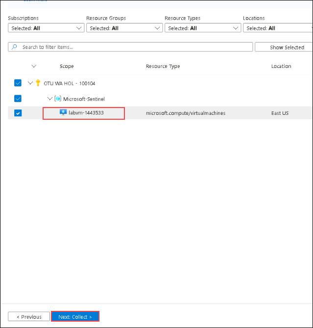

# Lab 1: Deploying Azure Sentinel and Onboarding Cloud Resources and Servers

### Estimated Duration: 60 minutes

In this lab, you will enable Azure Sentinel, deploy the Microsoft Sentinel Training Lab Solution, and onboard Azure resources and servers using data connectors. This setup provides access to advanced security analytics, a hands-on training environment with simulated data, and integration of various data sources. Together, these steps enhance your ability to monitor, detect, and respond to security threats effectively.

## Lab Objectives

In this lab, you will complete the following tasks:

* Task 1: Enable Azure Sentinel
* Task 2: Deploy the Microsoft Sentinel Training Lab Solution
* Task 3: Onboard Azure resources and servers to Azure Sentinel using data connectors

## Task 1: Enable Azure Sentinel

This task includes the creation of the Log Analytics Workspace and the initialization of the Microsoft Sentinel Workspace.

### Task 1.1: Create a Log Analytics Workspace

1. In the Azure Portal, from the upper left corner select the **menu (1)** icon with three lines as highlighted below and then select **+ Create a resource (2)**.

      

1. In the search box, type **Log Analytics Workspace** and select it from the search result.
   
      
   
1. Within the Marketplace page, click on **Create (1)** and select **Log Analytics Workspace (2)** from the **Log Analytics Workspace** resource card.

      

1. On the **Basics** tab of the **Create Log Analytics workspace**, enter the following details:
   
    -  **Subscription:** Select the default assigned subscription **(1)**.
    -  **Resource group:** Select **Microsoft-Sentinel** resource group from the drop-down list **(2)**.
    -  **Name:**  Enter **contoso-diagnosticworkspace-<inject key="Deployment-id" enableCopy="false"> (3)**
    -  **Region:** Select **<inject key="Region" enableCopy="false" /> (4)**.
    -  Click on **Review + Create (5)**.
   
       

1. Review the configuration of the analytics workspace and select **Create**.

      
   
1. Soon after the successful deployment of the **Microsoft.LogAnalyticsOMS**, on the overview page, click on **Go to resource** to view the newly created Log Analytics Workspace.

   

   <validation step="06261f11-0916-4517-b33a-7849b930014c" />

   > **Congratulations** on completing the task! Now, it's time to validate it. Here are the steps:
   > - Hit the Validate button for the corresponding task.
   > - If you receive a success message, you can proceed to the next task. If not, carefully read the error message and retry the step, following the instructions in the lab guide.
   > - If you need any assistance, please contact us at labs-support@spektrasystems.com. We are available 24/7 to help you out.

### Task 1.2: Initialize the Microsoft Sentinel Workspace

1. In the search bar of the Azure portal, type **Sentinel** **(1)** and select **Microsoft Sentinel** **(2)** from the list of search results.

      

1. Within the Microsoft Sentinel home page, click on **+ Create** to create and configure the Sentinel Workspace.

      

1. On the **Add Microsoft Sentinel to a Workspace** page, select the existing workspace i.e., **log-contoso-diagnosticworkspace-<inject key="Deployment-id" enableCopy="false"> (1)** which was created in the previous 
   task, then select **Add (2)**. This could take a few minutes.

      

1. Navigate around the newly created Microsoft Sentinel workspace to become familiar with the user interface options.

      
   
      >**Note**: The Microsoft Sentinel is deployed with a one-month free trial activation period. If you get a pop-up saying the **Microsoft Sentinel free trial activated**, click on **Ok**.

      

## Task 2: Deploy the Microsoft Sentinel Training Lab Solution

This task includes the deployment of the Training Lab solution into the existing workspace. This will ingest pre-recorded data (~20 MB) and create several other artifacts that will be used during the exercises.

1. In the Azure Portal, go to the global search bar and type **Microsoft Sentinel Training (1)**. Click on the **Microsoft Sentinel Training Lab Solution (2)** marketplace item.

      

1. Read the solution description in the overview tab and click on **Create**.

      

1. On the **Basics** tab of the **Create Microsoft Sentinel Training Lab Solution**, enter the following details: 
   
    - **Subscription:** Select the default assigned subscription **(1)**.
    - **Resource group:** Select **Microsoft-Sentinel** resource group from the drop-down list **(2)**.
    - **Workspace:** Select **contoso-diagnosticworkspace-<inject key="Deployment-id" enableCopy="false"> (3)**.
    - Click on **Review + Create (4)**.
  
      

1. Review the configuration of the Microsoft Sentinel Training Lab Solution and select **Create**.

      

      >**Note**: The deployment of the Microsoft Sentinel Training Lab Solution takes about **15 minutes**, so all the ingested data is ready to use once finished.

1. Once the deployment is successful, go back to the Microsoft Sentinel resource that was deployed in the previous task. On the **Microsoft Sentinel | Overview (Preview)** page, notice that there is some ingested 
   data and several recent incidents.

      

      >**Note**: Don't worry if you do not see the incidents initially as in the screenshot above, they might take up to 5 minutes to be raised. You can continue with the execution of the following tasks.

<validation step="b35587f1-14be-4918-bf43-8a69a2d2eade" />

> **Congratulations** on completing the task! Now, it's time to validate it. Here are the steps:
> - Hit the Validate button for the corresponding task.
> - If you receive a success message, you can proceed to the next task. If not, carefully read the error message and retry the step, following the instructions in the lab guide.
> - If you need any assistance, please contact us at labs-support@spektrasystems.com. We are available 24/7 to help you out.

## Task 3: Onboard Azure resources and servers to Azure Sentinel using data connectors

This task includes the establishment of a connection between Windows and M365 data in the Sentinel workspace.

### Task 3.1: Connect an Azure Windows Virtual Machine to Microsoft Sentinel

1. In the search bar of the Azure portal, type **Sentinel (1)**, then select **Microsoft Sentinel (2)**.

      

2. Select the Log Analytics Workspace that was created in the previous step.

      
 
3. On the Microsoft Sentinel page, follow the below instructions to install the data connector:

     - From the left navigation pane under **Content Management** click on **Content hub (1)**.
     - Search for **Windows Security Events (2)** from the search bar and select it **(3)**.
     - Click on **Install (4)** on the right navigation page that shows up.
    
       

       >**Note**: The installation may take up to a minute. Wait for the **Install Success** notification, after which you can now notice the **Installed** count has increased to **2**.

       

4. To configure **Windows Security Events via the AMA** data connector, perform the below steps:

     - From the left navigation pane, click on **Data connectors (1)** under the **Configuration** section.
     - Select the **Windows Security Events via AMA (2)** connector from the available list.
     - Click on **Open connector page (3)** from the right navigation pane.

       

5. In the Configuration section of the **Windows Security Events via AMA** page, click on the **+ Create data collection rule**.

      

6. On the **Basics** tab of the **Create Data Collection Rule** pane, enter the following details:

    - **Rule Name**: **windows-security-events-dcr** **(1)**
    - **Subscription:** Select the **default assigned subscription (2)**.
    - **Resource group:** Select **Microsoft-Sentinel** resource group from the drop-down list **(3)**.
    - Select **Next: Resources >** **(4)**

      

7. On the **Resorces** tab of the **Select a scope** page, perform the following steps:

    - Expand the resource group **Microsoft-Sentinel (1)**
    - Select the Windows virtual machine named **labvm-<inject key="Deployment-id" enableCopy="false"> (2)**
    - Click on ****Next:Collect** (3)**.

      

      >**Note**: This lab is provided with a pre-created Windows virtual machine (for the ease of the users), which can be added as a resource to connect with Microsoft Sentinel.

8. On the **Collect** page, follow the below instructions:

     - **Select which events to stream:** Select **All Security Events (1)**
     - Click on **Next : Review + Create> (2)**.
   
       

9. Review the configuration and click on **Create**.

    
   
   >**Note**: Wait for the **successfully installed extension** notification within the Azure portal implying that the DCR has been created along with the AMA being installed successfully. Select **Refresh** to see 
    the new data collection rule listed.

10. On the **Microsoft Sentinel | Data connectors** page, notice that now the **Windows Security Events via AMA** data connector is successfully connected with Microsoft Sentinel.

     

<validation step="a4dcb8b7-a9d9-4837-b230-49058bb72fca" />

> **Congratulations** on completing the task! Now, it's time to validate it. Here are the steps:
> - Hit the Validate button for the corresponding task.
> - If you receive a success message, you can proceed to the next task. If not, carefully read the error message and retry the step, following the instructions in the lab guide.
> - If you need any assistance, please contact us at labs-support@spektrasystems.com. We are available 24/7 to help you out.

### Task 3.2: Connect M365 data to Sentinel using Data connectors

1. In the search bar of the Azure portal, type **Sentinel (1)**, then select **Microsoft Sentinel (2)**.

      

1. Select the Log Analytics Workspace that was created in the previous step.

      
 
1. Within the Microsoft Sentinel page, execute the following steps to install the **Microsoft 365** solution:

      - Click on **Content hub (1)** under the **Content management** section from the left navigation pane.
      - Search **Microsoft 365 (2)** solution from the search bar.
      - Select **Microsoft 365 (3)** from the list of search results.
      - Click on the **Install (4)** button in the right navigation pane.

        

        >**Note**: The installation may take up to a minute. Wait for the **Install Success** notification after which you can notice that the **Installed** count has been increased to **3**.

         

1. From the **Data Connectors** tab, under the **Configuration** section in the left navigation pane of the Microsoft Sentinel page, select the **Microsoft 365 (1)** connector from the available list and click on 
   **Open connector page (2)** from the right navigation pane.

      

      >**Note**: You might have to refresh the Microsoft | Data connectors page to view the Microsoft 365 connector.

1. In the Configuration section of the **Microsoft 365** page, ensure to select all three check boxes **(1)** analogous to **Exchange**, **SharePoint**, and **Teams** respectively. Click on **Apply Changes (2)**.

      

      >**Note**: This lab is provided with required read/write access to the Sentinel workspace, along with the tenant having Security Administrator permissions to pre-handily meet the prerequisites for successfully 
   connecting data connectors.

1. Upon receiving the *Success* notification (which can be viewed from the notifications panel) within the Azure portal, it implies that the Microsoft 365 data connector has been successfully connected with Microsoft 
   Sentinel. This can also be validated by the change in the status to **Connected** as shown in the below screenshot:

      

## Summary

In this hands-on lab, you have enabled Azure Sentinel, deployed the Microsoft Sentinel Training Lab Solution, and onboarded Azure resources and servers using data connectors. 

### You have successfully completed this lab.
